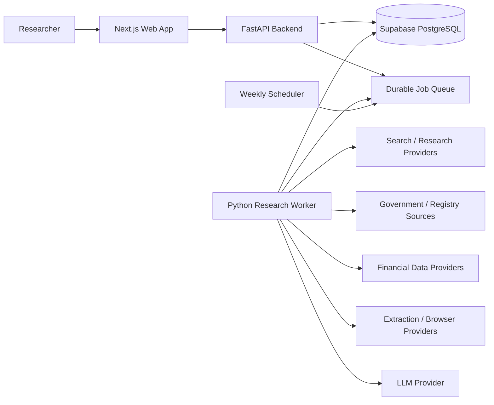
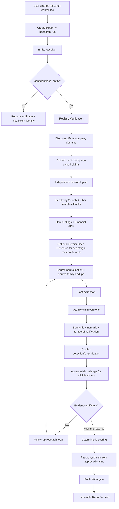
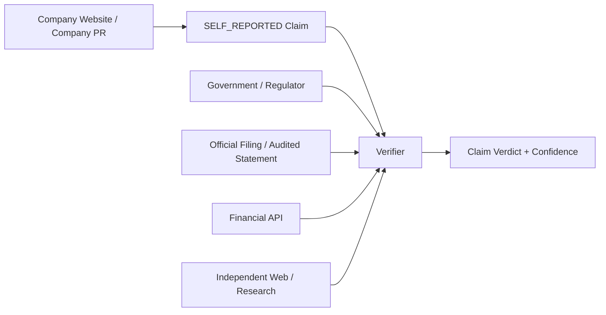
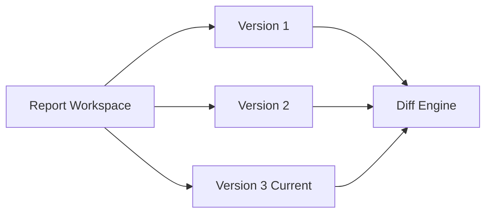
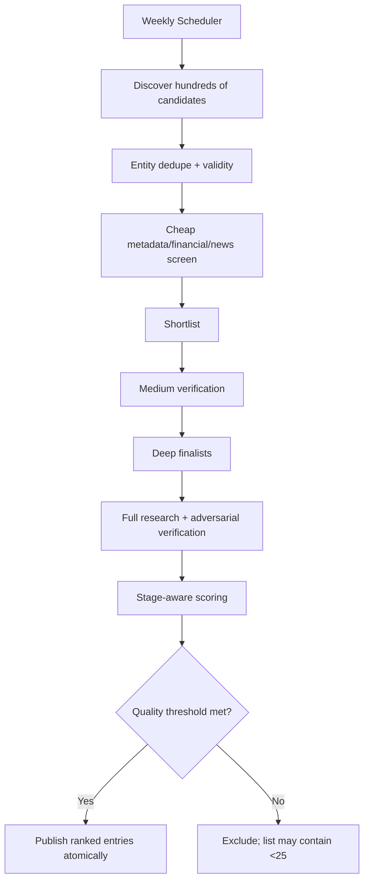
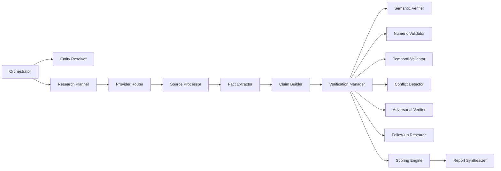

# High-Level Design (HLD)

## 1. System Context



## 2. Container Responsibilities

### Next.js Web App
- Authentication UI/session integration.
- Report library/sidebar.
- Research creation form and comparison flow.
- Live/polled research progress.
- Report reader, score cards, claims-vs-evidence table, evidence drawer, conflicts, history/diff.
- Weekly Top 25 discovery dashboard.
- No provider API keys and no direct external research calls.

### FastAPI Backend
- Auth/authorization boundary.
- User/report/company CRUD.
- Research-run creation and idempotency.
- Read APIs for stored results.
- Enqueues long-running work.
- Validates publication gates.

### Research Worker
- Research orchestration/state machine.
- Company/entity resolution.
- Provider routing/fallbacks.
- Extraction/fact/claim generation.
- Verification, conflicts, adversarial research, scoring.
- Report synthesis/versioning.
- Weekly watchlist funnel.

### PostgreSQL
- Canonical companies, source snapshots, claims/evidence/facts.
- Research/report versions.
- Scores and algorithm version.
- Jobs/audit events/provider calls.

## 3. End-to-End User Research Flow



## 4. Self-Reported vs Independent Evidence



Rule: `CW` can prove that the company **said** something, but cannot independently prove the underlying statement.

## 5. Provider Routing Architecture

```text
Research Need
   |
   +-- Web discovery -------- Perplexity -> Brave -> Exa -> Tavily(optional)
   +-- Page extraction ------ Firecrawl -> Exa Contents -> Browserless/Zyte
   +-- Deep research -------- Gemini Deep Research -> custom multi-search loop
   +-- US registry/filings -- SEC EDGAR
   +-- UK registry ---------- Companies House -> GLEIF/OpenCorporates
   +-- India registry ------- MCA/data.gov.in adapters -> GLEIF/OpenCorporates
   +-- Global identity ------ country registry -> GLEIF -> OpenCorporates
   +-- Financial facts ------ official filing/XBRL -> EODHD -> Twelve Data
   +-- News discovery ------- Perplexity/Brave -> GDELT
```

Provider output is normalized before domain logic. The domain never relies on provider-specific response shapes.

## 6. Truth Ledger

The Truth Ledger is the core product model:

```text
Company
  -> Fact(s)
  -> Claim
      -> ClaimVersion(s)
          -> Evidence relations
          -> Semantic verification
          -> Numeric verification
          -> Temporal verification
          -> Conflicts
          -> Adversarial result
          -> Confidence score
          -> Freshness state
```

Reports reference claim versions rather than duplicating truth.

## 7. Report Versioning



A refresh creates a new `ResearchRun` and, if successful, a new immutable `ReportVersion`. Old versions and score versions remain accessible.

## 8. Weekly Watchlist Architecture



No candidate is ranked solely because of news volume or company PR. Source independence, evidence coverage and business-stage normalization are part of eligibility/scoring.

## 9. C4 Component View: Research Worker



## 10. Deployment View

```text
Browser
  -> Vercel (Next.js)
       -> Persistent FastAPI service
            -> Supabase Postgres/Auth
            -> enqueue jobs
       Python Worker(s)
            -> provider APIs / permitted public internet
            -> Supabase Postgres

Scheduler (hosting cron / Supabase pg_cron / equivalent)
  -> enqueue weekly watchlist job
```

## 11. Scaling Strategy

V1: one API service + one or a few worker processes + PostgreSQL queue.

Scale when measured:
- increase worker concurrency per provider budget/rate limits;
- partition jobs by type/priority;
- add Redis/managed queue only when Postgres queue becomes bottleneck;
- separate crawler workers from LLM/deep-research workers only if load isolation is needed;
- use object storage for large source snapshots if database size warrants it.

## 12. Failure Philosophy

A provider failure is data about the run, not permission to guess.

Fallback chain ends in explicit status:
`NO_RESULTS`, `ACCESS_RESTRICTED`, `SOURCE_UNAVAILABLE`, `INSUFFICIENT_EVIDENCE`, or `PARTIAL`.

The system should be useful even when it concludes it cannot make a high-confidence statement.

