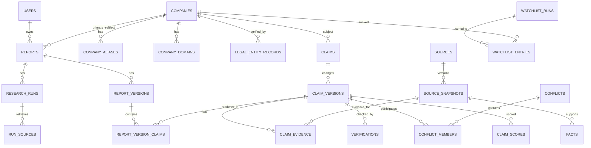

# Database Schema Specification

## 1. Goals

The database must preserve **research provenance over time**. It is not enough to store final report text. The core durable objects are companies, sources, snapshots, facts, claims, evidence, verification records, conflicts, scores, research runs and report versions.

## 2. Main Relationships

## 3. Entity Definitions

### `profiles`
Application-level user profile keyed to Supabase Auth user ID.

Fields: `id`, `display_name`, `created_at`, `updated_at`.

### `companies`
Canonical research entity.

Fields:
- `id`
- `canonical_name`
- `entity_type`: `PUBLIC_COMPANY`, `PRIVATE_COMPANY`, `STARTUP`, `BANK`, `INSURER`, `NONPROFIT`, `STATE_OWNED`, `SUBSIDIARY`, `OTHER`
- `country_code`
- `primary_ticker`, `primary_exchange`
- `official_domain_id` nullable
- `status`
- timestamps

Do not store every subsidiary as an alias. If a subsidiary is independently researched, it should be its own company/legal entity with a relationship.

### `company_aliases`
Former names, common names, abbreviations and alternate spellings.

### `company_domains`
Candidate/verified domains with verification status and provenance.

### `company_relationships`
Parent/subsidiary/acquisition/merger relationships with effective dates and evidence source.

### `legal_entity_records`
One company may have records from multiple registries.

Fields include registry/provider, jurisdiction, legal name, registration number, legal status, incorporation date, address metadata, retrieved time, source snapshot and freshness.

### `reports`
Persistent user workspace, not a generated document blob.

Fields: owner, title, primary company, report type/focus, current version ID, status.

`research_mode` records the requested analyst workflow: `INITIATION`,
`UPDATE`, `EARNINGS`, `EVENT`, `SECTOR`, or `DILIGENCE`. It is planning
metadata and must never alter a canonical claim verdict or publication gate.

### `report_thesis_points`
User-owned analyst propositions attached to a report. A point contains a
statement, a falsifier, materiality, a research posture (`OPEN`, `SUPPORTED`,
`WEAKENED`, or `UNCHANGED`), and an optional review note. Thesis posture is not
a verification verdict and is kept outside immutable claim/evidence history.

### `report_thesis_point_claims`
Optional links from a thesis point to exact claim versions. Relationship values
explain whether a cited claim version supports, weakens, or is otherwise
relevant to a thesis. The links preserve claim-version lineage rather than
copying claim text into a user-authored note.

### `report_companies`
Many-to-many for comparison reports.

### `research_runs`
One execution of the research pipeline.

Includes trigger (`USER`, `REFRESH`, `WEEKLY`, `SYSTEM`), requested depth, status, stage, budget, timestamps, prompt/config versions, error summary.

### `research_run_stages`
Detailed stage timeline/checkpoint.

### `provider_requests`
Audit of third-party calls. Store metadata, status, estimated cost, latency and safe request fingerprint. Never store secrets.

### `sources`
Stable logical source/document/publisher record.

Fields include an immutable normalized `identity_key`, canonical URL/document identity, publisher, source type, authority tier, ownership relationship, language, and primary/secondary indicator. The identity key deduplicates the same document across provider runs without treating provider agreement as independent evidence.

### `source_snapshots`
Immutable retrieval version. It stores a content hash, retrieval and publication timestamps, redirect lineage, permitted metadata, and an explicit retention mode: `FULL_TEXT`, `EXCERPT_ONLY`, `METADATA_ONLY`, or `STORAGE_REFERENCE`. Retention mode records what is permitted to be stored; it is never inferred from public accessibility.

### `source_families` and `source_family_members`

Durable independent-origin grouping for syndicated, quoted, duplicate, or common-root material. One source belongs to one canonical family; the membership reason, confidence, and explanation remain inspectable. Downstream verification counts source families, not URLs or providers.

### Fact, claim, and evidence provenance

`facts` preserve raw values alongside typed fields and validated extraction metadata. `claim_versions` record claim kind, versioned structured representation, and extraction metadata; prior versions remain immutable and corrections use supersession. `claim_version_facts` links each claim version to the fact records it relies on, while `claim_evidence` always points to a source snapshot and records evidence role, directness, and independence. The database constrains scalar confidence/directness ranges; domain persistence rejects self-reported sources as independent support.

### Verification and publication quality

`verifications` are append-only, versioned checks for semantic, numeric, temporal, adversarial, source-authenticity, and entity-scope evidence. `report_versions.verification_gate` records the deterministic gate result, coverage, blockers, conflicts, reasons, and implementation versions. A report version cannot persist as `VERIFIED` unless its gate explicitly passed; a blocked but useful report remains `READY`.

Fields include source ID, content hash, published/retrieved dates, title, permitted extracted text or object-storage reference, metadata, redirect chain.

### `source_relationships`
Used to detect fake consensus/syndication.

Types: `DERIVED_FROM`, `SYNDICATED_FROM`, `QUOTES`, `REFERENCES`, `SAME_ORIGIN_AS`.

### `run_sources`
Which source snapshots were used by a research run and how they were discovered.

### `facts`
Structured extracted facts before/alongside narrative claims.

Key fields: company, metric code, raw value text, explicit original numeric value/currency/unit, explicit normalized numeric value/currency/unit, period start/end/label, accounting basis, entity scope, source snapshot, nullable provider request lineage, and extraction confidence. Missing values stay absent; they never default to zero. Facts from official filings and commercial fallbacks remain separate observations.

### `claims`
Stable claim identity for a company/topic.

Fields: subject company, canonical key, claim category, claim origin (`SELF_REPORTED`, `INDEPENDENT`, `DERIVED`, `SYSTEM`), materiality.

### `claim_versions`
Actual claim text/value at a point in research history.

Includes research run, statement, structured value, verdict, freshness, supersedes version.

### `claim_evidence`
Join between claim version and source snapshot.

Fields: evidence role (`SUPPORTS`, `CONTRADICTS`, `CONTEXT`, `ORIGIN`), excerpt/location, directness, independence flag.

### `verifications`
Normalized verification records.

Types: `SEMANTIC`, `NUMERIC`, `TEMPORAL`, `ADVERSARIAL`, `SOURCE_AUTHENTICITY`, `ENTITY_SCOPE`.

Stores outcome, score if applicable, details, verifier implementation/model/prompt version, created time.

### `calculations`
Deterministic derivations with formula code/version, typed inputs, output and tolerance. `calculation_facts` records immutable input-fact references, allowing a derived amount to be reproduced from a formula version and the exact observations used.

### `conflicts`
Disagreement group across facts/claims.

Fields: conflict type, severity, status (`OPEN`, `RESOLVED`, `ACCEPTED_UNCERTAINTY`), explanation, canonical resolution if any. Conflict creation records the comparability dimensions, both observed values, source-family-root count, and any restatement supersession in the resolution payload; it never stores a fabricated midpoint.

### `conflict_members`
Claims/facts participating in a conflict.

### `claim_scores`
Versioned deterministic claim confidence breakdown.

### `disclosure_score_snapshots`
Company-level disclosure reliability + coverage for a specific report/run and score version.

### `company_score_snapshots`
Business/financial/watchlist score components. Separate from research confidence.

### `report_versions`
Immutable published/saved output projection.

Fields: report, research run, version number, title, summary, structured section JSON, status, score snapshots, generated time.

### `report_version_claims`
Exact claim versions referenced by a report version and section/order.

### `watchlist_runs`
One weekly ranking job. Has methodology version and publish status.

### `watchlist_entries`
Company rank, cohort, score, eligibility info, previous-rank delta, linked report/version.

### `jobs`
Durable background queue linked to an optional `research_run_id`. Jobs use
priority, availability, leases, attempt counts, idempotency keys, and safe
error summaries. PostgreSQL workers claim with row locking; the service role
owns queue writes and client roles cannot read or mutate delivery state.

### `audit_events`
User/admin/system event trail for report operations, score overrides/config changes and publication actions.

## 4. Key Enums

### Claim verdict
- `UNVERIFIED`
- `VERIFIED`
- `PARTIALLY_SUPPORTED`
- `CONTRADICTED`
- `INSUFFICIENT_EVIDENCE`
- `STALE`

### Source type
- `GOVERNMENT_REGISTRY`
- `REGULATORY_FILING`
- `AUDITED_FINANCIAL`
- `FINANCIAL_API`
- `COMPANY_WEBSITE`
- `COMPANY_PRESS_RELEASE`
- `INDEPENDENT_NEWS`
- `INDEPENDENT_RESEARCH`
- `SEARCH_RESULT`
- `OTHER`

### Authority tier
- `A1_GOVERNMENT_REGULATOR`
- `A2_AUDITED_REGULATORY`
- `B1_STRUCTURED_FINANCIAL`
- `B2_INSTITUTIONAL_INDEPENDENT`
- `C1_REPUTABLE_INDEPENDENT_MEDIA`
- `D1_SELF_REPORTED`
- `E1_GENERAL_WEB`
- `E2_UNKNOWN_WEAK`

Authority is contextual, not absolute; freshness and responsibility for the specific fact still matter.

## 5. Indexing

Minimum indexes:
- `companies(lower(canonical_name))`
- ticker/exchange composite
- aliases normalized text
- legal registry + registration number unique where possible
- reports owner + updated_at
- research_runs report + created_at
- source canonical URL
- source_snapshots source + retrieved_at desc
- source_snapshots content_hash
- facts company + metric + period
- facts provider request lineage
- claims company + canonical_key
- claim_versions claim + created_at desc
- claim_evidence claim_version
- report_versions report + version_number unique
- watchlist_entries run + rank unique
- jobs status + available_at

Use Postgres trigram/full-text indexes for entity/report search if needed before adding an external search engine.

## 6. RLS/Ownership

- Users can read/write their own `reports` and user-specific report versions through authenticated policies.
- Users can read/write only their own `report_thesis_points` and linked
  claim-version references. This RLS scope does not grant direct write access to
  canonical claims or evidence.
- Public weekly watchlists and explicitly public report versions can be read through controlled views/endpoints.
- Shared canonical company/source/evidence data is not directly writable by client roles.
- Service-role/backend performs research writes.
- Never expose provider request secrets/raw tokens.

## 7. Immutability

Immutable after creation except explicit metadata corrections:
- source snapshots
- report versions
- verification records
- calculation records
- score snapshots
- audit events

Corrections create superseding records rather than rewriting historical truth where practical.

## 8. Data Retention

- User deletion should remove/de-identify user-owned workspace data according to product policy.
- Shared public-source metadata may remain if independently collected and policy/licensing allows.
- Full crawled content retention depends on source terms/licensing; prefer hashes + excerpts + storage pointers where uncertain.
- Provider logs have configurable retention and secret redaction.
